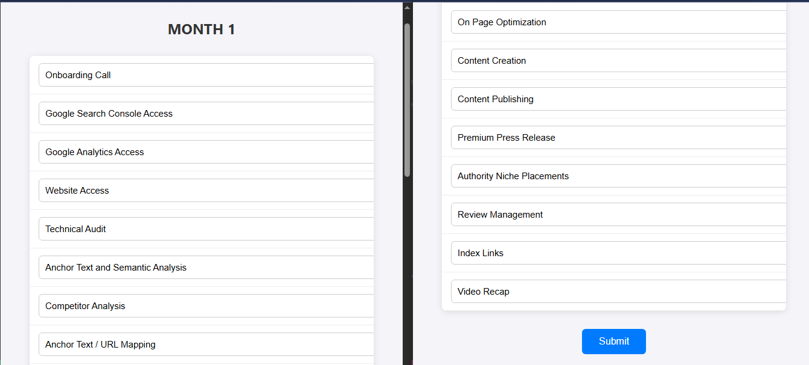

# React UMD Editable Task Table – Technical Task (Frontend Only)

This project is a frontend-only task built with **ReactJS 18 UMD scripts** directly in a static HTML page — no Node.js, no build tools, no backend.

> 📝 Objective: Create a simple editable table using ReactJS, with data that is ready to POST (no actual API call required).

---

## ✨ Features

- ✅ ReactJS via CDN using UMD build
- ✅ Fully static HTML + JS (no Node or npm)
- ✅ Editable single-column task list (as per design)
- ✅ Data stored in React state
- ✅ POST-ready JSON output (visible via console)
- ✅ Polished UI with clean layout

---

## 📸 Screenshot



---

## 📁 File Structure

```
📦 Task1/
├── index.html       # Main file with React UMD + Babel
├── style.css        # Style Css
├── screenshot.png   # UI preview
└── README.md        # This file
```

---

## 🧪 How to Run

> Just open `index.html` in your browser – that’s it!

### ⚙️ Steps:

1. Download or clone this repository.
2. Open `index.html` with any browser (Chrome, Firefox, etc.).
3. Edit the task names as needed.
4. Click **Submit** and open browser console to see POST-ready data.

---

## 📤 Example Output (Console Log)

```json
["Onboarding Call", "Google Search Console Access", "Technical Audit"]
```

---

## 🚫 No Backend Needed

No Node.js or backend server was required in this task.  
The final data structure is **ready to be POSTed** to any backend/API.

---

## 👨‍💻 Author

**Sourabh Badgaiya**  
🔗 GitHub: [github.com/sourabhbadgaiya2](https://github.com/sourabhbadgaiya2)

---
