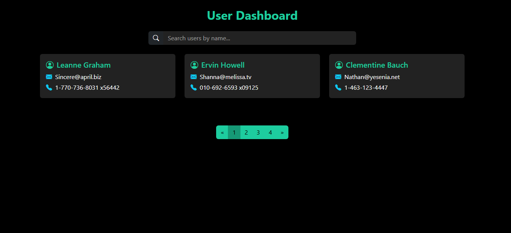

# 🚀 User Dashboard – React + Bootstrap

This is a responsive user dashboard built using **React.js**, **Axios**, and **Bootstrap 5**.  
It fetches user data from a public API and displays it in a paginated, searchable card-based UI.

## ✨ Features

- ✅ Built with React.js + Vite
- ✅ Styled using Bootstrap 5 and Bootstrap Icons
- ✅ Server-side pagination using `_page` and `_limit` query params
- ✅ Search functionality (within current page)
- ✅ Responsive card layout displaying:
  - Name
  - Email
  - Phone
- ✅ Pagination with Previous / Next support

---

## 📸 Screenshot



---

## 🛠️ Technologies Used

- React 18
- Axios
- Bootstrap 5
- Bootstrap Icons
- Vite (React template)

## Getting Started

### 🧪 Prerequisites

- Node.js installed (v14+ recommended)
- npm or yarn

### ⚙️ Installation

```bash
git clone https://github.com/sourabhbadgaiya2/VYQDA-Project.git
cd user-dashboard
npm install
npm run dev
```

## API Used

Data is fetched from the following public API:  
https://jsonplaceholder.typicode.com/users

This API supports server-side pagination using:

```
?_page=1&_limit=3
```

Note: The API contains only 10 users total, so maximum 4 pages are possible with 3 users per page.

## How Pagination Works

- The app sends a GET request to the API with query params like:
  https://jsonplaceholder.typicode.com/users?_page=2&_limit=3
- On each page change, only 3 users are fetched from the server.
- Search functionality applies to users on the current page only.

---

## 👨‍💻 Author

**Sourabh Badgaiya**  
🔗 GitHub: [github.com/sourabhbadgaiya2](https://github.com/sourabhbadgaiya2)

---
